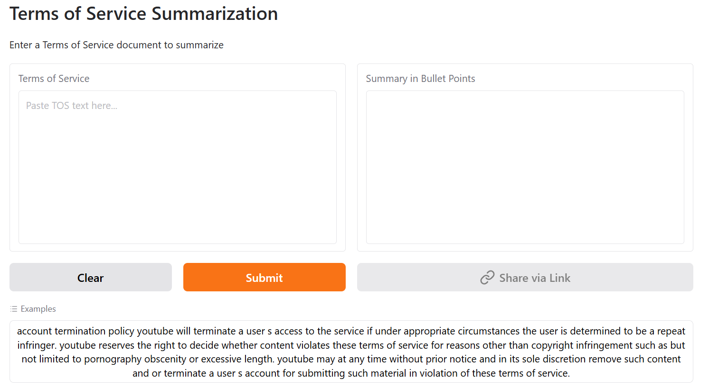

# TOS-Summarization
Terms of Service that come with any product or service is not only lengthy and time-consuming to read but are also difficult to understand. As a result most people often skip and directly agree to the terms. However, given the current digital world with cyber-crimes being prevalent in every part of the world, it is highly important to be aware of ones right and how your data is being processed by the service provider. 

Hence, we build a summarizer that can summarize the TOS into bullet points for better readability. For this purpose we experimented with various Extractive and Abstractive models.

## Table of Contents
- [Overview](#TOS-Summarization)
- [Models Used](#extractive-models) 
    - [Extractive Model](#extractive-models)
    - [Abstractive Model](#abstractive-models)
- [Comparative Analysis](#comparative-analysis)
- [Demo](#demo)
- [How to Run Locally](#how-to-run-locally)

## Extractive Models
### **Text Rank**<br>
* It is an unsupervised and language-agnostic algorithm inspired by Google’s PageRank.
* It builds a graph of words and ranks them based on how they co-occur in the text
* Words are the nodes and edges are created between co-occurring words within a fixed window size.
* The weight of the edge may reflect frequency of co-occurrence
* In this Words that appear frequently with many other important words get higher scores. 
* It does not understand semantics well and depends on syntactic proximity (not context). Due to which it may extract generic or less relevant phrases if preprocessing isn’t robust.

## Abstractive Models
### **1. BART**<br>
BART (Bidirectional and Auto-Regressive Transformers) developed by Facebook AI (now Meta AI) in 2019 is a sequence-to-sequence (seq2seq) model that combines -
* BERT (Bidirectional Encoder): For understanding context from both left and right.
* GPT (Autoregressive Decoder): For generating fluent text.

The architecture contains fully bi-directional encoder and autoregressive decoder. 
The model is trained to reconstruct the original text from a corrupted version by applying various noise transformations such as -
* Token Masking
* Token Deletion
* Sentence Permutation
* Text Infilling 
* Document Rotation

BART variants used -
* facebook/bart-base (https://huggingface.co/facebook/bart-base)
* facebook/bart-large-cnn (https://huggingface.co/facebook/bart-large-cnn)

### **2. Pegasus**<br>
PEGASUS (Pre-training with Extracted Gap-sentences for Abstractive Summarization) developed by Google Research in 2020 is specifically designed for abstractive text summarization tasks.

It uses the concept of Gap Sentence Generation (GSG). In this important sentences are masked/removed from the input and the model is trained to generate those sentences based on the remaining text.

This simulates the summarization task more closely than traditional masked language modeling (like BERT).

For our specific case we used the following variants -
* google/pegasus-billsum (https://huggingface.co/google/pegasus-billsum)
* nsi319/legal-pegasus (https://huggingface.co/nsi319/legal-pegasus)

### **3. BigBird**
BigBird (Big Transformer with Sparse Attention) developed by Google Research in 2020 scales to long sequences by replacing standard full attention with sparse attention, while retaining high performance.

The sparse attention transformer helps -
* Enables processing of sequences up to 4096–8192+ tokens.
* Reduces memory and compute complexity to O(n).
* Retains performance close to full attention models.

It uses combination of 3 spare attention mechanisms -
* Global: It attends to fixed set of tokens which focuses on important summary tokens
* Random: Attends to random positions to add connectivity
* Local: Attends to fixed size window to capture neighbouring context

Variants used -
* google/bigbird-pegasus-large-arxiv (https://huggingface.co/google/bigbird-pegasus-large-arxiv)

### **4. Longformer**
Lonformer introduced by Allen Institute for AI also uses sparse attention mechanism to handle long documents.

The sparse attention mechanism it uses is called sliding window attention. It helps -
* Enables processing of sequences up to 4096–8192+ tokens.
* Reduces memory and compute complexity to O(n).
* Uses less memory and faster inference.

It uses combination of sparse and full attention -
* Sliding Window Attention: Each token attends to a fixed-size window around it (like a CNN).
* Global Attention: Selected tokens (e.g., [CLS]) attend to and are attended by all tokens.
* Dilated: Optional variation that allows attention to skip tokens to increase range.

This structure enables dense attention in important places and sparse attention elsewhere, balancing efficiency and performance.

Variant used -
* allenai/led-base-16384 (https://huggingface.co/allenai/led-base-16384)

## Comparative Analysis
We used ROUGE (Recall Oriented Understudy of Gisting Evaluation) as evaluation metric.

|**Model** | **ROUGE-1** | **ROUGE-2**| **ROUGE-L**|
|----------|-------------|------------|------------|
|TextRank  | 23.6 | 7.02 | 20.2 |
|Bart Base | 21.5 | 5.99 | 18.79 |
|BART Large CNN | 28.2 | **13.72** | 26.11 |
|Pegasus Billsum | 25.9 | 8.85 | 22.6 |
|Pegasus Legal | 25.2 | 7.85 | 22.87 |
|BigBird Pegasus | 24.56 | 6.88 | 21.33 |
|Longformer | **28.97** | 13.49 | **27.05** |

Overall, Longformer outperforms all other models, with BART Large CNN coming close to it.

## Average Inference Time
|**Model** | **Inference Time**|
|----------|-------------|
|BigBird Pegasus | 10.39 ± 0.57 s|
|Pegasus Legal | 6.89 ± 1.13s |
|Longformer | **3.11 ± 0.04 s**|

**Overall, Longformer performs considerably better in terms of both ROUGE score and inference time.**

## Demo
A demo using Longformer is available at -
https://huggingface.co/spaces/aarushi-211/TOS-Summarizer



## How to Run Locally
1. Clone the repo:
```bash
git clone https://github.com/aarushi211/TOS-Summarization.git
cd TOS-Summarization
```
2. Install dependencies
```
pip install -r requirements.txt
```
3. Run app locally
app.py uses pegasus
app2.py uses longformer
```
cd '.\Front End\'
python app2.py
```