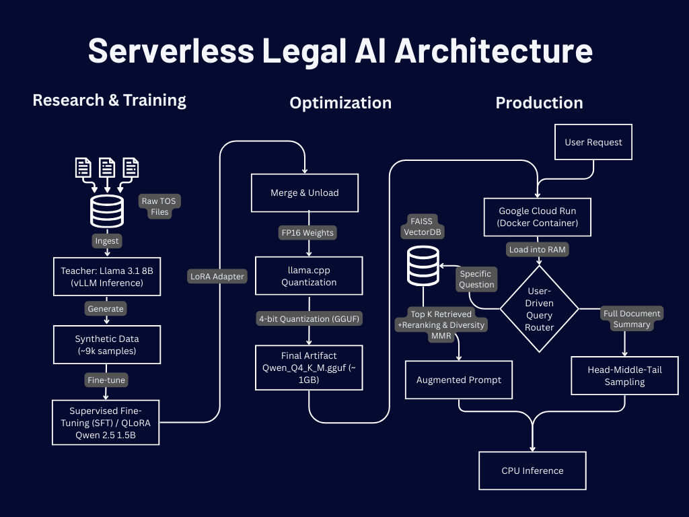

# 📜 TOS-Summarizer: Distilled Legal AI


## 🚀 Project Overview

**TOS-Summarizer** is a high-fidelity, dual-path AI system designed to solve the "Too Long; Didn't Read" problem of legal documents. By combining **Model Distillation & Style Transfer** with a **Dual-Path RAG architecture**, it distills 100+ page Terms of Service into actionable insights on low-cost, serverless infrastructure.

| Feature | Technical Solution | Impact |
| :--- | :--- | :--- |
| **Context Length** | **Head-Middle-Tail Sampling** | Captures global context (18k+ tokens) without "Lost-in-the-Middle" bias. |
| **High Precision** | **Dense RAG Path** | Uses FAISS + Cross-Encoder reranking for grounded, evidence-based Q&A. |
| **Model Efficiency** | **Model Distillation & Style Transferx** | Distilled Llama 3.1 8B logic into a lightweight **Qwen 2.5 1.5B** student. |
| **Edge-Ready** | **4-bit GGUF Quantization** | Optimized for fast, CPU-only inference on **Google Cloud Run**. |
| **Scalability** | **Scale-to-Zero Docker** | Fully containerized architecture with zero idle-compute costs. |

## 🏗️ System Architecture & Key Contributions
The system utilizes a **Dual-Path Inference** design to ensure both high-level executive summaries and pinpoint clause-level precision.

### 1. Dual-Path Inference Pipeline
* **Global Context Path: Global Summarization**
    * **Strategy:** Implements **"Head-Middle-Tail" Sampling** (6k characters per segment) to extract 18k tokens of global context, effectively bypassing the "lost-in-the-middle" phenomenon in long legal docs.
* **Atomic Retrieval Path: Targeted RAG (Q&A)**
    * **Retrieval:** **FAISS** vector store with **Maximal Marginal Relevance (MMR)** to ensure chunk diversity.
    * **Reranking:** Integrated **Cross-Encoder Reranking** to ensure the most legally salient evidence is prioritized for the LLM.

### 2. MLOps & Optimization
* **Model Distillation & Style Transfer:** Fine-tuned a **Qwen 2.5 1.5B (Student)** using **Llama 3.1 8B (Teacher)** to retain complex reasoning within a 1GB footprint.
* **Quantization:** Converted to **4-bit GGUF** via `llama.cpp`, enabling sub-second inference on standard CPU-only environments.
* **Cloud Infrastructure:** Fully containerized with **Docker** and deployed on **Google Cloud Run**, utilizing scale-to-zero logic for maximum cost-efficiency.

<!--  -->
<p align="center">
  
</p>

## 🔗 Live Demo
[Live Demo on Google Cloud Run](https://tos-summarization-service-110277869308.us-central1.run.app/) 
> (Note: The app runs on a scale-to-zero instance. Please allow ~1 min for the first cold start.)

## 🧠 Engineering Methodology

### Phase 1: Synthetic Data Engineering
To overcome the scarcity of high-quality legal datasets, I built a **Teacher-Student pipeline** to bootstrap a custom training corpus.
* **Data Source:** Raw legal text from the TOSDR corpus (via [Sonu Gupta](https://github.com/sonu-gupta/tosdr-terms-of-service-corpus)).
* **Teacher Model:** **Llama 3.1 8B Instruct** served via **vLLM (PagedAttention)** on an NVIDIA T4 GPU.
* **Outcome:** Generated **9,000+ grounded summaries**, mapping dense legal clauses to abstractive executive summaries.

### Phase 2: Model Distillation & SFT
I transitioned from the 8B teacher to an edge-friendly student model via **Supervised Fine-Tuning (SFT)**.
* **Student Model:** **Qwen 2.5 1.5B**.
* **Training Technique:** **QLoRA (4-bit)** to maximize parameter efficiency.
* **Memory Optimization:** Implemented **Gradient Accumulation and Checkpointing** to manage VRAM overhead while maintaining high reasoning capabilities.

### Phase 3: Quantization & Serverless Deployment
Final optimization aimed for zero-cost idle time and CPU-only execution.
* **GGUF Conversion:** Leveraged `llama.cpp` for **4-bit (GGUF) quantization**, shrinking the model footprint from 3GB to **~1GB**.
* **Containerization:** Optimized **Docker** multi-stage builds to minimize image size and mitigate cold-start latency.
* **Infrastructure:** Deployed on **Google Cloud Run** with a 4GiB memory ceiling and optimized concurrency for a cost-effective, scale-to-zero architecture.

## 📊 Evaluation & Analysis

While the model achieved high scores in semantic consistency, I implemented a custom observability pipeline to stress-test its factual grounding.

### Performance Metrics
| Metric | Score | Insight |
| :--- | :--- | :--- |
| **Faithfulness** | **0.945** | Verified via LLM-as-a-Judge; confirms high grounding in source text. |
| **BERTScore** | **0.701** | Demonstrates strong semantic consistency post-quantization. |
| **ROUGE-L** | **0.310** | High lexical overlap with critical legal terminology. |
| **BLEU** | **0.151** | Respectable n-gram precision for a 1.5B parameter student model. |

>**🔍 Discovery: Prompt-Induced Stability & Interface Drift** <br>
During the evaluation phase using Rivet, I initially identified a performance gap that I attributed to Knowledge Distillation (the "Boilerplate Drift"). However, a deep-dive into the model's behavior revealed a more nuanced engineering lesson:
>- **The Problem:** High-complexity prompts were "over-steering" the 1.5B student model, causing it to fall back on its pre-trained "legal tropes" (memorized boilerplate) to satisfy the high instruction overhead.
>- **The Engineering Solution:** By Simplifying the Prompt Architecture and aligning the Ollama Modelfile specifically with the model’s native ChatML template, I achieved a stable, factual state without any "Boilerplate Drift."
>- **Key Insight:** For edge-deployed LLMs (1.5B–3B parameters), prompt-to-parameter ratio is critical. A simplified, direct prompt allowed the model to focus its limited attention on the 18k tokens of retrieved context rather than parsing complex system instructions.

### Model Selection Trade-off
| Model | Size | Rationale |
| :--- | :--- | :--- |
| **Qwen 2.5 1.5B** | **~1 GB** | **Production Choice:** Selected for cost-sensitive, scale-to-zero serverless environments with high clause recall. |
| **Mistral 7B** | ~7.5 GB | **High-Fidelity Choice:** Better for high-risk interpretation where latency/cost are secondary. |

> **Limitations:** Evaluation is based on synthetic teacher summaries; jurisdiction-specific legal nuances are not explicitly modeled.

---

## 💻 Local Installation

Run the summarizer locally using Streamlit:

```bash
# 1. Clone the Repository
git clone https://github.com/aarushi211/Summarization-of-TOS.git
cd Summarization-of-TOS

# 2. Set up Environment
python -m venv venv
source venv/bin/activate  # Windows: venv\Scripts\activate
pip install -r requirements.txt

# 3. Launch App
streamlit run app/app.py

## Deployment & MLOps
Deploying LLMs to serverless infrastructure presents unique challenges regarding memory, build times, and cold starts. 
```

👉 **[Read the full Deployment Engineering Guide](DEPLOYMENT.md)** to see how I solved Docker build timeouts and optimized inference for CPU-only environments.

## 🔮 Future Work & Scalability
While the current MVP demonstrates a successful distillation and deployment pipeline, the following enhancements are planned to move from a research prototype toward a production-grade legal AI service:

**1. Production Engineering & Security (Short Term):**
* **Stateless API Transition:** Decoupling the Streamlit frontend from the RAG engine by implementing a FastAPI backend. This will enable proper session management and horizontal scaling.
* **Multi-Tenancy & Data Isolation:** Implementing UUID-based session state and partitioned storage within the Cloud Run Volume Mounts to ensure 100% data isolation between concurrent users.
* **Request Sandboxing:** Enhancing the URL ingestion layer with a validation proxy to mitigate SSRF risks and sanitize scraped HTML content.

**2. Algorithmic Enhancements (Mid Term):**
* **Hybrid Retrieval Engine:** Integration of BM25 (Sparse Search) alongside FAISS to improve recall for specific legal terminology and exact phrase matching.
* **Recursive Sectional Summarization:** Moving beyond "Head-Middle-Tail" sampling toward a hierarchical summarization approach to ensure 100% clause coverage for documents exceeding 50+ pages.

**3. Evaluation & Compliance (Long Term):**
* **RAGAS Benchmarking:** Implementing the RAGAS framework to provide automated, multi-dimensional evaluation of retrieval precision, faithfulness, and context utilization.
* **Jurisdictional Context Injection:** Incorporating metadata filters to adjust analysis based on regional laws (e.g., GDPR vs. CCPA).
