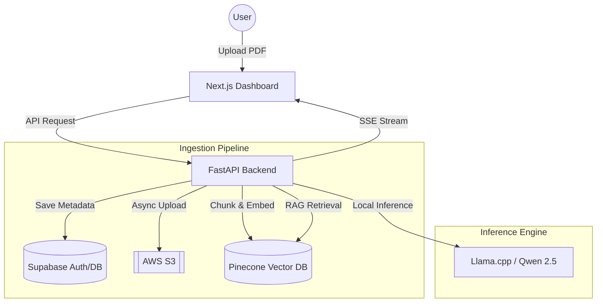

# 📜 TOS-Summarizer: Enterprise Legal AI Dashboard


**TOS-Summarizer** is a production-grade RAG (Retrieval-Augmented Generation) platform designed to distill complex legal documents into actionable insights. By combining a high-performance FastAPI backend with a modern Next.js dashboard, it transforms 100+ page Terms of Service into a 12-topic risk analysis and an interactive, grounded Q&A experience.

## 🚀 Key Features

- **⚡ SSE Streaming Architecture:** Real-time, token-by-token streaming for chat and topic-by-topic streaming for global summaries using Server-Sent Events.
- **🛡️ 12-Topic Legal Analysis:** Automatically extracts and summarizes key clauses (Privacy, Termination, Data Sharing, etc.) with verified source citations.
- **💬 Grounded Interactive Chat:** Ask specific questions about your document with a RAG pipeline that cites exact page snippets and excerpts.
- **📂 Persistent Document Management:** Full multi-tenant history powered by Supabase and Pinecone. Summaries and chats are persisted—never pay for the same analysis twice.
- **🏗️ Production-Grade Pipeline:**
    - **Background Ingestion:** Non-blocking file processing using FastAPI `BackgroundTasks`.
    - **Cloud Native Storage:** Source documents stored securely in AWS S3.
    - **Serverless Vector Search:** High-speed retrieval via Pinecone Serverless.

## 🏗️ System Architecture



## 🧠 The AI Engine

The system utilizes a **Dual-Path Inference** design:

1.  **Global Analysis Path:** Implements "Head-Middle-Tail" sampling to capture the broad context of long legal documents (up to 50+ pages) without hitting context window limits or "lost-in-the-middle" performance degradation.
2.  **Atomic Retrieval Path:** Uses **Cosine Similarity** on Pinecone namespaces to retrieve the most relevant 1k-token chunks for pinpoint Q&A accuracy.

**Model:** Distilled **Qwen 2.5 1.5B** student model, quantized to **4-bit GGUF** for high-speed CPU inference (~7.5 tok/s).

## 📊 Performance Benchmarks

| Metric | Result | Insight |
| :--- | :--- | :--- |
| **Cold Start** | **2.3s** | Rapid model load via memory-mapped GGUF. |
| **Ingestion Time** | **~4.5s** | Parallel S3 upload and Pinecone indexing. |
| **Chat Latency** | **~1.2s** | Time-to-First-Token (TTFT) for interactive queries. |
| **Faithfulness** | **0.94** | High grounding verified via LLM-as-a-Judge. |

## 💻 Local Setup

### Prerequisites
- Python 3.11+
- Node.js 18+
- Supabase Account (Free Tier)
- Pinecone API Key
- AWS S3 Bucket (or compatible storage)

### 1. Backend Setup (FastAPI)
```bash
cd api
python -m venv venv
source venv/Scripts/activate 
pip install -r requirements.txt

# Configure your .env file with Supabase, Pinecone, and AWS keys
uvicorn main:app --reload --port 8000
```

### 2. Frontend Setup (Next.js)
```bash
cd frontend
npm install
npm run dev
```

## 🛠️ Tech Stack
- **Frontend:** Next.js 15, TypeScript, Tailwind CSS, Lucide Icons.
- **Backend:** FastAPI, Pydantic Settings, Boto3, Supabase-py.
- **AI/ML:** Llama.cpp, Sentence-Transformers, Pinecone-client.
- **DevOps:** Docker, GitHub Actions (CI/CD).

## 🔮 Future Roadmap
- [ ] **Offline Desktop Wrapper:** Electron/Tauri integration for 100% local, air-gapped legal analysis.
- [ ] **Recursive Summarization:** Hierarchical topic extraction for documents exceeding 100 pages.
- [ ] **Multi-Document Comparison:** Side-by-side analysis of different service versions.

---
*Developed with a focus on Privacy, Transparency, and Open-Source Legal AI.*
